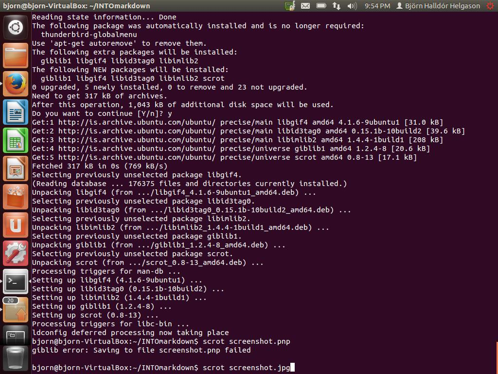
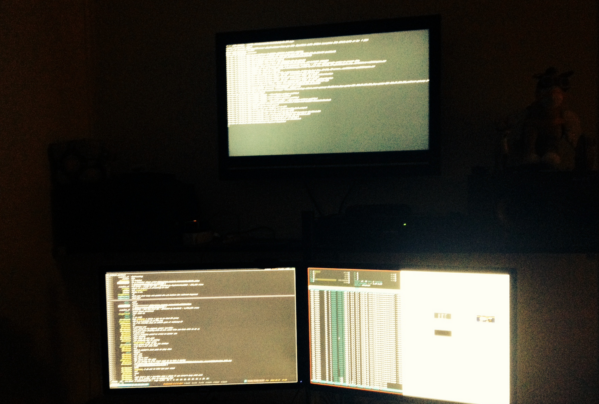

#Open Source


####Hópmeðlimir####

1. Anton Vilhelm Ásgeirsson

2. Björn Halldór Helgason

## 1. Linux uppsetning

**Björn:**

Uppsetning á Virtual Box og Linux gekk snurðulaust fyrir sig. Eftir að hafa installað Virtual Boxinu sótti ég Ubuntu Linux kerfi sem ég svo installaði í gegnum Virtual Boxið. Öll uppsetning gekk einsog áður sagði afar vel fyrir sig og engin alvarleg vandamál stóðu í vegi mínum.



**Anton:**

Ég lét það vera að setja upp Linux á virtual vél þar sem ég keyri Linux á borðtölvunni.


Ég keyri:
```shell
uname -a 
Linux localhost 3.11.5-1-ARCH #1 SMP PREEMPT Mon Oct 14 08:31:43 CEST 2013 x86_64 GNU/Linux
```
## 2. Uppsetning á vim && git

**Björn:**

Uppsetning á vim og git gekk einstaklega vel, með einni skipun í Terminal var allt uppsett og tilbúið til keyrslu.

**Anton:**

Pakkakerfi Arch Linux er mjög öflugt og myndi uppsetningarferlið líta einhvernvegin svona út:

```shell
pacman -S vim && pacman -S git
``` 
## 3. Unnið með Git (1. hluti)

Það að forka vim verkefninu var lítið mál. Eftir að github aðgangur hafði verið búinn til þurfti maður einfaldlega að smella á 'Fork' takkann.

Eftir að Björn ([bjornhall](https://github.com/Bjornhall/)) forkaði verkefnið bætti hann mér við sem collaborator sem gaf mér push réttindi á hans repo.

Við bættum við litlu falli í leikinn sem prentar út notendanöfnin okkar við ákveðna skipun.

[Hér](https://github.com/Bjornhall/INTOPrufa)
er hlekkur á okkar útgáfu af 
[NIM](https://github.com/Bjornhall/INTOPrufa)


## 4. Uppsettur hugbúnaður

Hugbúnaðurinn sem við notuðum var að öllu leyti opinn og að mestu frjáls. 
Hér er listi yfir part af þeim hugbúnaði sem var settur upp og notaður:

####Opin hugbúnaður####

1. Linux

2. Vim

3. Git

4. Urxvt

5. Tmux 

## 5. Unnið með Git (2. hluti)

Í heildina gekk þetta mjög vel fyrir sig. Virtualbox uppsetningin gekk vel á tölvunni hans [Björns](https://github.com/Bjornhall/) á meðan að [Anton](https://github.com/antonva/) keyrði á Arch Linux á borðvél.
Uppsetningin á VIM og git gekk mjög vel fyrir sig sem og uppsetning á github account og að forka repoinu. Það er ágætt að kynna sér markdown (*ef þó ekki nema bara til að commenta á reddit*) og alltaf ágætt að kíkja á syntaxinn.
